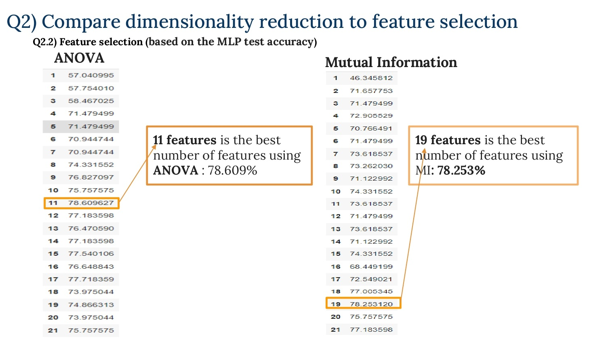
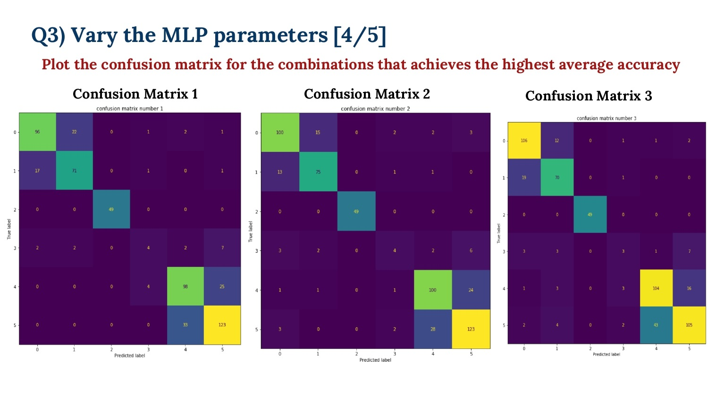

# Machine-learning-Project_Detect-anomalies-using-Deep-learning Using tuning many different hyper parameters parameters like (learning rate, hidden layer,activation function, batch size) and do grid search to select the best hyper parameters and do dimentionality reduction and feature selection then plot tsne  
 
A simple and well designed structure is essential for any machine learning project, project template that combines **simplicity, best practice for CODE structure** and **good CODE design**. 
The main idea is that there's much same stuff you do every time when you start our machine learning project, so wrapping all this shared stuff will help you to change just the core idea every time you start our machine learning project. 

**So, here’s a simple readme template that help you get into our project faster and just focus on your notice and explanations, etc.)**

In order to decrease repeated code shanks, increase the time that can read the code in, flexibility an reusability we used a functional programming structure that focused on split all problems in our project in functions and use that functions many times in many places in the code without repeating the code.
 

# Requirements
- [numpy](https://numpy.org/) (The fundamental package for scientific computing with Python)
- [pandas](https://pandas.pydata.org/) (pandas is a fast, powerful, flexible and easy to use open source data analysis and manipulation tool, built on top of the Python programming language.) 
- [google.colab.drive](https://colab.research.google.com/) (library to integrate google colab with google drive)
- [requests](https://pypi.org/project/requests/) (library to easily use API with python)
- [json](https://docs.python.org/3/library/json.html) (library to easily use JSON with python)
- [sklearn](https://scikit-learn.org/stable/) (Machine Learning and Data Analysis Library in Python)
- [matplotlib](https://matplotlib.org/) (Matplotlib is a comprehensive library for creating static, animated, and interactive visualizations in Python)
- [seaborn](https://seaborn.pydata.org/) (Seaborn is a Python data visualization library based on matplotlib. It provides a high-level interface for drawing attractive and informative statistical graphics.)
)
- [tensorflow](https://www.tensorflow.org/) (deep learning library developed by google)
- [keras](https://keras.io/) (deep learning library developed by google work on tensorflow)
- [tqdm](https://tqdm.github.io/) (Instantly make your loops show a smart progress meter - just wrap any iterable with)
- [imblearn](https://pypi.org/project/imblearn/) (Toolbox for imbalanced dataset in machine learning.)
- [gzip](https://docs.python.org/3/library/gzip.html) (This module provides a simple interface to compress and decompress files just like the GNU programs gzip and gunzip would.)
-  
# Run the Code
- Upload the ipynb code file into "Google Colab"  
- Press "Run All" in the control panel or "Restart Kernel and Run All" to run all code notebooks

 
 
# Contributing
Any kind of enhancement or contribution is welcomed.

 

 

 

